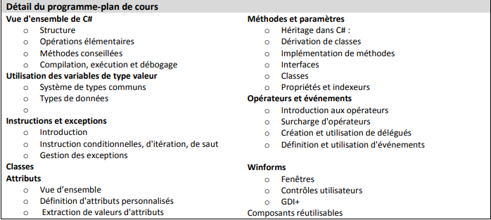

# Cesi 2019 C# - MineZone

## Contexte

Notre client souhaite créer une "mini" alternative au service Amazon pour l'achat de livres nommée `MinieZone` (à lire avec l'accent Alsacien bien entendu). **L'interface graphique n'est pas une prioritée** pour le moment: le client étudie encore le marché avant de décider s'il veut commencer avec un site web, s'il préfère une application mobile ou s'il se lance sur une application desktop. 

Nous sommes chargés de développer un prototype qui démontre que nous maitrisons le sujet. Ce prototype sera jugé par une liste de développeurs qui maitrise le C# et qui s'attend à appeler une librairie .Net  (de préférence : la plus récente et la plus évolutive possible).

Le client n'a pas encore eu le temps d'établir un cahier des charges exhaustif mais il propose de nous accompagner dans le développement de l'application en nous envoyant les exigences au fur et à mesure. Il se réserve également le droit de changer certaines de ces exigences. 

Le code source du prototype doit être déposé et versionné avec un repertoire Git qui lui est accessible. Le minimum attendu est d'avoir une branche "master" qui contient systématiquement du code qui fonctione (compile/fonctionne/testé). Un README.md est conseillé. Le client a besoin de version fonctionnelle très régulièrement pour qu'il puisse avancer sur ses propres développement et implémenter votre bibliothèque le plus rapidement possible.

## Déroulement

Notre équipe a une réunion de coordination de 5min à 10min tous les matins devant un tableau Kanban.

Ayant peu d'expérience en C#, notre équipe va également se rassembler tous les soirs pendant 30min pour partager et valider les connaissances acquises au cour de la journée. Il est demandé à chacun d'avoir quelques notes sur les concepts et nouvelles notions utilisées/apprises au cours de la journée. 

Nous espérons qu'en partageant et en vérifiant régulièrement notre travail, nous apprendrons mieux et plus rapidement.

## Exigences

### Jour1

#### Tache 1 

Créer une structure de données qui permet de gérer des commandes. Chaque commande a un identifiant unique. Une commande est passée à une certaine date et contient une panoblie d'articles. La somme doit être affichée de manière décomposée avec notamment la somme hors-taxe, la somme tout taxe comprises et un montant demandé pour la livraison. La somme ne doit pas être modifiable.

#### Tache 2 (interne)

Le développeur Junior s'emmêle les pinceaux : est-ce qu'il faut utiliser une class ? une struct ?  une partial class ? une abstract class ?
Merci de lui expliquer plus précisément les différences pour qu'il soit (enfin!) autonome.

### Jour 2

#### Tache 3

On nous demande de rajouter l'adresse de livraison au niveau de la commande.

#### Tache 4

Chaque commande doit contenir une adresse de facturation et une date de livraison prévue (par défault = 1 semaine après la commande). L'adresse de facturation doit également renseigner les informations supplémentaires "Nom et Prénom de facturation".

#### Tache 5 (interne)

Feedback du developeur Junior: Il ne sait pas quel type de donnée utiliser pour représenté la somme du prix des articles à payer pour une commande. `decimal` ou `double` ?

-> Faites des tests: calculez la somme de 10 article coutant 0.1€ à l'unité. (Utilisez une somme, puis utilisez une multiplication... comparez les 2 types)

### Jour 3

#### Bug A ?!

Un marchand a fait une erreur dans le prix d'un de ses articles. La sommes de la commande est négative ?! Merci d'empecher cette erreur de se reproduire.

#### Tache 6

Pour 1 à 3 articles la livraison en France coûte 5€, 10€ au niveau de l'UE, 20€ pour une livraison internatinatiole.

#### Tache 7

Nos analystes souhaiterai connaitre le prix moyen d'un article pour une commande.

### Jour 4

#### Bug B ?!

Un utilisateur nous informe qu'il obtient l'erreur `DivideByZeroException` lorsqu'il essaye de passer commande et que le système "crash" suite à cette erreur. Nous n'avons pas retrouvé sa commande dans nos systèmes.

#### Tache 8 (amélioration du systeme suite au bug B)

Nous souhaitons empêcher l'utilisateur de passée une commande avec 0 articles. S'il essaye malgré tout. Merci de lui afficher un message d'erreur "Impossible de passer une commande qui ne contient aucun article" lié à une exception "EmptyArticleException". Bien évidemment cette exception doit être gérée proprement et ne pas faire crasher le système !

Il faudrait également s'assurer de logger cette exception pour détecter rapidement si elle se produit régulièrement.  Et si possible dans quel contexte elle se produit.

#### Tache 9 (interne)

Feedback du developeur Junior: Hashset, List, IEnumerable : que choisir pour représenter l'ensemble des articles d'une commande ?!

#### Tache 10

Nous voulons que la personne qui passe commande renseigne son sexe. L'objectif à terme est d'analyser les commandes et de voir s'il y a des tendances qui se dégagent par rapport à ce critère. 

### Jour 5

#### Tache 11 interne

Nos collègues Polonais nous informent que la date n'est pas correcte et que certains caractères s'affichent bisarrement. 

#### Tache 12

Au-dessus de 3 articles la livraison est offerte en France, au-dessus de 50€ la livraison est offerte au sein de l'UE et au-dessus de 5 articles qui coutent un minimum de 100€ la livraison est offerte à l'international.

### Jour 6

#### Tache 13

Changement dans les requirements : pour l'UE la livraison gratuite sera au-dessus de 50€ **OU 4 articles**. 

#### Tache 14 

Ajouter un `attribut` qui s'assure que le nom d'un article ne puisse pas être vide ou ne contenir que des espaces.

### Jour 7 

#### Tache 15 

Le client souhaite intégrer notre bibliothèque dans sa pipeline d'intégration continue. Il nous demande de lui expliquer rapidement quelles sont les commandes de bases qu'il pourrait utiliser pour compiler et tester notre bibliothèque.

### Jour 8

#### Tache 16

Le client souhaite faire une campagne de promotion. Toutes les 1000 commandes recevront un bon de réduction de 100€. A nous d'implémenter une solution qui se charge de surveiller et de compter le nombre de commandes passées. 

Requête spéciale des développeurs du client: il faudrait utiliser un `event` appelé "OrderCompleted". (Indice : jettez un oeil aux `delegate`)
